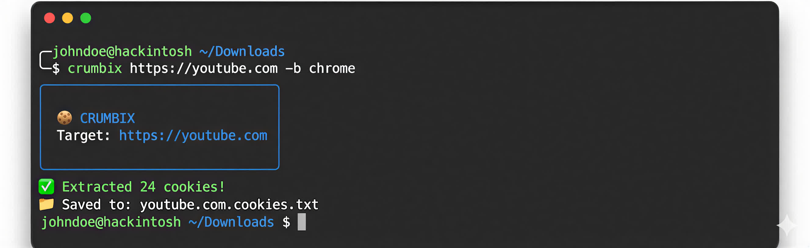

# crumbix



A cross-platform CLI tool to extract browser cookies for any URL and save them in Netscape `cookies.txt` format.

## Installation

This tool is best installed via `pipx` to keep dependencies isolated.

**1. Install pipx (if you don't have it):**

```bash
python3 -m pip install --user pipx
python3 -m pipx ensurepath
```

*Restart your terminal after running the above.*

**2. Install Crumbix:**

Since the package is not on PyPI, install directly from GitHub:

```bash
pipx install git+https://github.com/ogpourya/crumbix.git
```

## Usage

> ⚠️ **Important Note:** Crumbix filters by **domain only**, not by specific URL path. 
> 
> If you enter `https://example.com/login`, it will save cookies for **all** of `example.com` (including `/`, `/api`, etc.). The specific path is saved in the file but is not used to filter the cookies.

**Basic:**

```bash
crumbix https://github.com
```

**Specific Browser:**

```bash
crumbix https://stackoverflow.com --browser firefox
```

**Custom Output:**

```bash
crumbix https://google.com -o my_cookies.txt
```

## Options

| Option | Alias | Description | Default |
| :--- | :--- | :--- | :--- |
| `--browser` | `-b` | Browser to extract from (`chrome`, `firefox`, `brave`, `edge`, `opera`, `safari`) | `chrome` |
| `--output` | `-o` | Custom filename for the output file | `<DOMAIN>.cookies.txt` |
| `--help` | | Show the help message and exit | |

## License

MIT
